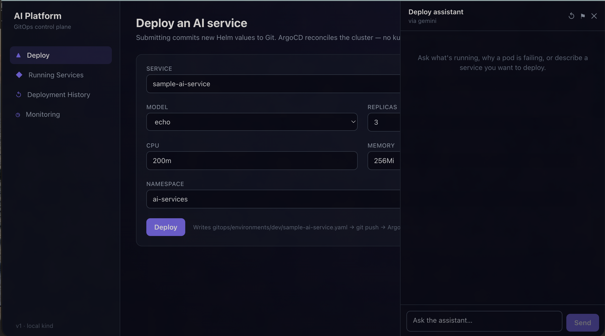

# AI Platform — Kubernetes GitOps (v1)

An internal platform for deploying AI services to Kubernetes via a GitOps
workflow — **no `kubectl` after setup**. A Next.js dashboard talks to a FastAPI
control plane, which commits Helm values to Gitea. ArgoCD watches that repo and
reconciles the cluster. Prometheus + Grafana handle observability.

v1 runs entirely on a **local `kind` cluster** — no cloud account needed.



*The dashboard — a six-field deploy form, with the deploy assistant (here backed
by Gemini) alongside it. Ask what's running, why a pod is failing, or describe a
service to deploy; the assistant proposes settings and a human clicks Deploy.*

---

## Why this was built

Shipping an AI service to Kubernetes usually means someone who knows `kubectl`,
Helm, and the cluster's quirks doing it by hand — and that creates three
problems this platform exists to remove:

- **No single source of truth.** Hand-run `kubectl apply` leaves the cluster in a
  state no file describes. Here **git is the source of truth**: every deploy is a
  commit to a Helm values file, ArgoCD reconciles from it, and the backend has
  **read-only** cluster access. The cluster can't drift from what's in git, and
  every change has an author, a diff, and a revert.

- **The knowledge doesn't scale.** Knowing that a workload needs `512Mi` or three
  replicas, or what a crash-loop means, lives in a few people's heads. The
  **deploy assistant** answers from *this* cluster's real state — live pods, logs,
  metrics, deploy history, and a store of issues it has seen before — so the
  advice reflects reality rather than generic Kubernetes lore. It *proposes*
  settings; it never touches git or the cluster itself.

- **Safety can't depend on discipline.** The assistant reads workload-controlled
  data (pod logs can print anything) and suggests deploy parameters. So the
  guardrails are structural, not procedural: there is **no tool that writes** to
  git or the cluster, proposals are re-validated server-side, secrets are redacted
  at the boundary, and a human clicks the final Deploy. A prompt-injected log line
  cannot become a commit.

The result is a platform where a deploy is a reviewable git commit, the tribal
knowledge is queryable, and the AI assistant makes the easy path the safe one —
all runnable on a laptop with no cloud account.

---

## How it works

```
Next.js dashboard ─▶ FastAPI control plane ─▶ Gitea (git = source of truth)
                          │ reads k8s API           │ watched by
                          ▼                          ▼
                     pods/logs/metrics          ArgoCD ─▶ Kubernetes ─▶ sample-ai-service
                          ▲                                                   │ /metrics
                     Prometheus ◀──────────────────────────────────────────── ┘
                          ▲
                     Grafana (iframed in dashboard)
```

**The one invariant:** deploys go through git, never `kubectl`. `POST /api/deploy`
mutates the service's Helm values file, commits, and pushes. ArgoCD reconciles
from that commit. The backend has read-only k8s RBAC — it cannot write to the
cluster directly.

---

## Prerequisites

| Tool | Install (macOS) |
|------|----------------|
| Docker | [docker.com/get-started](https://www.docker.com/get-started) |
| kind | `brew install kind` |
| kubectl | `brew install kubectl` |
| Helm | `brew install helm` |
| Node.js ≥ 18 | `brew install node` |
| Python ≥ 3.11 | `brew install python` |

---

## Quickstart

```bash
# 1. Bring up the full platform (takes ~5 min on first run)
make up

# 2. Print service URLs
make demo

# 3. Tear everything down
make down
```

`make up` runs `scripts/bootstrap.sh` which:
1. Creates a local Docker registry on port `5001`
2. Creates a `kind` cluster named `ai-platform`
3. Installs ingress-nginx + metrics-server
4. Installs ArgoCD
5. Installs Gitea and seeds the GitOps repo
6. Installs kube-prometheus-stack (Prometheus + Grafana)
7. Builds and pushes platform images to the local registry
8. Deploys the platform (dashboard + backend) via Kustomize
9. Deploys the sample AI service via ArgoCD

After `make demo`, open:

| Service | URL |
|---------|-----|
| Dashboard | http://dashboard.127.0.0.1.nip.io |
| ArgoCD | http://argocd.127.0.0.1.nip.io |
| Grafana | http://grafana.127.0.0.1.nip.io |
| Gitea | http://gitea.127.0.0.1.nip.io |

---

## Deploying a service

1. Open the dashboard
2. Select **sample-ai-service**
3. Set replicas, CPU, memory (and optionally image tag or model)
4. Click **Deploy**

The backend commits updated Helm values to Gitea. ArgoCD detects the commit
(reconciles every 30 s) and rolls out the change. The dashboard's **Services**
tab shows live pod status; **Monitoring** shows Prometheus metrics; **History**
shows the git commit log.

---

## Onboarding a new AI service

The platform can deploy any containerised service — not just `sample-ai-service`.
Here is the contract your service must satisfy and the three files you must add.

### HTTP contract (required)

The Helm chart's liveness and readiness probes, Prometheus scraping, and the
dashboard's service view all depend on these endpoints being present:

| Endpoint | Method | Must return |
|----------|--------|-------------|
| `/health` | `GET` | `{"status": "ok"}` — liveness probe |
| `/ready` | `GET` | `{"status": "ready"}` — readiness probe (block until the service is warm) |
| `/metrics` | `GET` | Prometheus text format (`text/plain; version=0.0.4`) |

Your service must listen on **port 8000** (the Helm chart's `targetPort`).

If your service is not an HTTP server (e.g. a LiveKit worker, a background
consumer, or a CLI process), wrap it with a small FastAPI health sidecar running
in a background thread so the probes are satisfied while your main process runs.

```python
# minimal sidecar — add to any non-HTTP process
import threading, uvicorn
from fastapi import FastAPI
from prometheus_client import generate_latest, CONTENT_TYPE_LATEST
from fastapi.responses import Response

_health_app = FastAPI()

@_health_app.get("/health")
def health(): return {"status": "ok"}

@_health_app.get("/ready")
def ready(): return {"status": "ready"}

@_health_app.get("/metrics")
def metrics(): return Response(generate_latest(), media_type=CONTENT_TYPE_LATEST)

threading.Thread(
    target=uvicorn.run, args=(_health_app,),
    kwargs={"host": "0.0.0.0", "port": 8000}, daemon=True
).start()
```

### Docker image

Build and push to the in-cluster registry before deploying:

```bash
docker build -t localhost:5001/<your-service>:<tag> apps/<your-service>/
docker push localhost:5001/<your-service>:<tag>
```

The registry runs at `localhost:5001` (started by `make up`). The image name
becomes the `image.repository` value in your values file.

> **Note:** If your service needs system packages (e.g. `ffmpeg` for audio,
> `libsndfile` for audio I/O), install them in your Dockerfile — the base Python
> slim images do not include them.

### File 1 — GitOps values (`gitops/environments/dev/<your-service>.yaml`)

Copy `gitops/environments/dev/sample-ai-service.yaml` and update the fields.
This file is the ArgoCD source of truth; the platform backend rewrites it on
every deploy.

```yaml
# MANAGED BY THE PLATFORM BACKEND.
replicaCount: 1

image:
  repository: localhost:5001/<your-service>
  tag: "0.1.0"

resources:
  requests:
    cpu: 100m
    memory: 128Mi
  limits:
    cpu: 500m
    memory: 512Mi

autoscaling:
  enabled: true
  minReplicas: 1
  maxReplicas: 5
  targetCPUUtilizationPercentage: 70

# Non-sensitive config → ConfigMap (readable in pod env)
env:
  SERVICE_NAME: <your-service>
  MODEL: <model-id-or-echo>

# Sensitive config → Secret (e.g. API keys)
secretEnv:
  MY_API_KEY: ""        # fill via dashboard or kubectl secret patch

ingress:
  enabled: true
  host: <your-service>.127.0.0.1.nip.io
```

### File 2 — ArgoCD Application (`gitops/argocd/applications/<your-service>.yaml`)

Copy `gitops/argocd/applications/sample-ai-service.yaml` and replace the
service name. ArgoCD's app-of-apps picks this up automatically.

```yaml
apiVersion: argoproj.io/v1alpha1
kind: Application
metadata:
  name: <your-service>
  namespace: argocd
spec:
  project: default
  source:
    repoURL: http://gitea.gitea.svc.cluster.local:3000/platform/gitops.git
    targetRevision: main
    path: charts/ai-service
    helm:
      valueFiles:
        - ../../../gitops/environments/dev/<your-service>.yaml
  destination:
    server: https://kubernetes.default.svc
    namespace: ai-services
  syncPolicy:
    automated:
      prune: true
      selfHeal: true
```

### File 3 — Dockerfile

The shared `charts/ai-service` Helm chart is image-agnostic — it only cares
about the HTTP contract above. Bring your own Dockerfile. Pattern from the
sample service:

```dockerfile
FROM python:3.12-slim AS builder
WORKDIR /app
COPY requirements.txt .
RUN pip install --no-cache-dir --prefix=/install -r requirements.txt

FROM python:3.12-slim AS runtime
# Install system deps your service needs (e.g. ffmpeg for audio):
# RUN apt-get update && apt-get install -y --no-install-recommends ffmpeg && rm -rf /var/lib/apt/lists/*
ENV PYTHONUNBUFFERED=1 PYTHONDONTWRITEBYTECODE=1
RUN useradd --create-home --uid 10001 appuser
COPY --from=builder /install /usr/local
WORKDIR /app
COPY app ./app
USER appuser
EXPOSE 8000
HEALTHCHECK --interval=15s --timeout=3s --retries=3 \
  CMD python -c "import urllib.request,sys; sys.exit(0 if urllib.request.urlopen('http://localhost:8000/health').status==200 else 1)"
CMD ["uvicorn", "app.main:app", "--host", "0.0.0.0", "--port", "8000"]
```

### What the platform handles for you

Once the three files above are committed and your image is pushed, the platform
takes care of:

- GitOps deploy loop — dashboard `POST /api/deploy` mutates the values file and commits
- ArgoCD reconciliation every 30 s — no `kubectl apply` needed
- HPA scaling (min/max replicas from the values file)
- Ingress routing via nginx at `<your-service>.127.0.0.1.nip.io`
- Prometheus scraping via `ServiceMonitor`
- Secret injection from `secretEnv` via a Kubernetes `Secret`
- ConfigMap injection from `env`
- Pod status, logs, and metrics visible in the dashboard

### Services that need external dependencies

Some AI services (voice agents, speech pipelines) depend on external cloud
services rather than a local model. These work fine — the platform treats them
as regular deployments. Supply credentials via `secretEnv`; the service dials
out through normal cluster egress. The platform does **not** provide:

- A LiveKit server (use LiveKit Cloud or self-host separately)
- STT/TTS cloud services (DeepGram, ElevenLabs, etc.)
- LLM APIs (Mistral, OpenAI, Anthropic, etc.)
- GPU nodes (v1 is CPU-only; add a node pool for GPU workloads in v2)

---

## Development

### Install backend dependencies

```bash
pip install -r apps/platform-backend/requirements.txt
```

### Run the backend locally

```bash
cd apps/platform-backend
uvicorn app.main:app --reload
# API at http://localhost:8000  (requires a running cluster for k8s/metrics routes)
```

### Run the frontend locally

```bash
cd apps/platform-frontend
npm install
NEXT_PUBLIC_API_BASE=http://localhost:8000 npm run dev
# Dashboard at http://localhost:3000
```

### Run tests

```bash
make test
# Runs: pytest (core loop) + helm lint + helm template + next build
```

Or the core loop only (no cluster needed):

```bash
python3 -m pytest tests/test_gitops_loop.py -q
```

### Other make targets

```bash
make build   # Build + push app images to the local registry
make lint    # Helm lint only
make demo    # Print the service URLs
```

---

## Project layout

```
.
├── apps/
│   ├── platform-backend/       # FastAPI control plane
│   │   └── app/
│   │       ├── main.py         # Route definitions (/api/deploy, /services, /logs, /metrics, /history)
│   │       ├── gitops.py       # The deploy loop — git commit/push via GitOps class
│   │       ├── k8s.py          # Read-only cluster views (pods, logs)
│   │       ├── metrics.py      # Prometheus PromQL proxy
│   │       ├── auth.py         # Auth seam (stub in v1; slot JWT here later)
│   │       └── config.py       # 12-factor env config with sane in-cluster defaults
│   ├── platform-frontend/      # Next.js + Tailwind dashboard
│   │   └── app/
│   │       ├── page.tsx        # Deploy form (home)
│   │       ├── services/       # Live pod status
│   │       ├── monitoring/     # Grafana iframe + Prometheus metrics
│   │       └── history/        # Git commit log
│   └── sample-ai-service/      # Deployable FastAPI AI service (/generate, /metrics)
├── charts/
│   └── ai-service/             # Helm chart: Deployment/Service/Ingress/HPA/ServiceMonitor
├── gitops/
│   ├── argocd/                 # ArgoCD Application manifests (app-of-apps)
│   └── environments/dev/       # Per-service Helm values — the GitOps source of truth
├── infra/
│   └── terraform/              # AWS EKS/ECR/VPC modules (code only, not applied in v1)
├── monitoring/                 # kube-prometheus-stack values + Grafana dashboard JSON
├── scripts/
│   ├── bootstrap.sh            # Full platform bringup
│   ├── teardown.sh             # Cluster + registry teardown
│   ├── seed-gitea.sh           # Creates Gitea org/user/repo and pushes the gitops tree
│   └── build-load-images.sh    # Builds images and pushes to local registry
└── tests/
    └── test_gitops_loop.py     # Core loop guard (pure-function + end-to-end git test)
```

---

## Backend API

| Method | Path | Description |
|--------|------|-------------|
| `GET` | `/api/health` | Liveness check |
| `POST` | `/api/deploy` | Commit updated Helm values and push to Gitea |
| `GET` | `/api/services` | Live Deployment/pod status from the cluster |
| `GET` | `/api/logs/{pod}` | Tail pod logs (`?tail=200`) |
| `GET` | `/api/metrics` | Prometheus headline metrics (rps, p95 latency, error rate, inflight) |
| `GET` | `/api/history` | Git commit log (`?service=sample-ai-service`) |
| `GET` | `/api/config` | Non-secret runtime config (namespace, etc.) |

### Deploy request body

```json
{
  "service": "sample-ai-service",
  "replicas": 2,
  "cpu": "200m",
  "memory": "256Mi",
  "namespace": "ai-services",
  "image_tag": null,
  "model": null,
  "env": {}
}
```

---

## Configuration

All backend config is environment-driven. Defaults work out-of-the-box inside
the cluster. Override via env vars for local development:

| Env var | Default | Description |
|---------|---------|-------------|
| `GITOPS_REPO_URL` | in-cluster Gitea URL | Git remote the backend commits to |
| `GITOPS_BRANCH` | `main` | Branch ArgoCD watches |
| `GITOPS_VALUES_TEMPLATE` | `gitops/environments/dev/{service}.yaml` | Path pattern to per-service values |
| `GITOPS_WORKDIR` | `/tmp/gitops` | Local clone path inside the backend pod |
| `AI_NAMESPACE` | `ai-services` | Kubernetes namespace the platform watches |
| `PROMETHEUS_URL` | in-cluster Prometheus URL | PromQL endpoint |
| `GIT_AUTHOR_NAME` | `platform-bot` | Git commit author name |
| `GIT_AUTHOR_EMAIL` | `platform-bot@local` | Git commit author email |

---

## Architecture notes

- **`apply_settings()` in `gitops.py` is a pure function** — no I/O, fully
  unit-tested. `GitOps` wraps it with git I/O. Keep it pure.
- **One global git lock** serializes all commits because the workdir is a single
  shared checkout. Per-service locks are the upgrade path if throughput matters.
- **Identical re-deploys are no-ops** — if the values file is unchanged after
  `apply_settings`, no commit is made.
- **Backend is read-only against the cluster** — status and logs use the k8s API;
  writes go through git → ArgoCD only.
- **`ponytail:` comments** in source mark intentional v1 simplifications (wide-open
  CORS, stubbed auth, single namespace) and name the upgrade path.

---

## Deploy assistant (chat)

A conversational assistant sits alongside the dashboard (the ✦ button, bottom
right). It answers from **real platform state** — running services, pod logs,
current metrics, deployment history, ArgoCD sync status, and a growing store of
issues the platform has seen before — reached through read-only tools, not a
prompt full of stale context. It can **propose** deploy settings with its
reasoning; you click Deploy and the existing `POST /api/deploy` does the work.

**The GitOps invariant holds.** The assistant has no tool that writes to git or
the cluster. Its strongest action is proposing a deployment, which is
re-validated server-side and confirmed by a human before any commit.

Configure it at bootstrap — it is **off by default** (the platform is fully
functional without it):

```bash
LLM_PROVIDER=claude ANTHROPIC_API_KEY=sk-ant-... ./scripts/bootstrap.sh   # hosted (Anthropic)
LLM_PROVIDER=gemini GEMINI_API_KEY=AIza...       ./scripts/bootstrap.sh   # hosted (Google)
LLM_PROVIDER=openai OPENAI_API_KEY=sk-...        ./scripts/bootstrap.sh   # hosted (OpenAI)
LLM_PROVIDER=ollama ./scripts/bootstrap.sh                                # fully local, no data egress
```

- **`claude`** uses the Anthropic API (`CLAUDE_MODEL`, default `claude-opus-5`).
- **`gemini`** uses the Google Gemini API (`GEMINI_MODEL`, default
  `gemini-flash-latest` — the `-latest` alias always resolves; pinned names like
  `gemini-2.5-pro` 404 for some keys).
- **`openai`** uses the OpenAI Chat Completions API (`OPENAI_MODEL`, default
  `gpt-4o-mini`; any tool-calling model works).
- The three hosted options send cluster state (service names, pod logs **after
  secret redaction**) to the provider — a real data-egress decision. The key
  lives only in the `platform-backend-secrets` secret, created imperatively by
  `bootstrap.sh`, never committed.
- **`ollama`** runs a local model in-cluster; nothing leaves the cluster. Costs
  a one-time model pull at bootstrap. Needs a tool-calling model
  (`llama3.1`, `qwen2.5`, …).

The provider is a one-file seam (`app/llm/`): each backend translates the same
canonical message/tool format to its own wire format, so adding another is a new
adapter plus a factory branch.

Safety controls: pod logs and git history are wrapped in `<untrusted_data>` tags
so the model treats them as data; secrets are redacted at the boundary
(`app/redact.py`); deploy proposals are re-validated through the same Pydantic
model the deploy endpoint enforces; and a per-conversation token budget plus a
per-IP rate limit bound abuse. Metrics for the subsystem (tokens, cache-hit
ratio, tool calls, latency) land on the Grafana dashboard.

Retrieval is BM25 over SQLite FTS5, with a golden-set eval
(`tests/eval/rag_eval.py`) reporting recall@5 — the seam for a vector/hybrid
retriever is `app/store/knowledge.py:Retriever` if the number drops.

---

## Deferred (v2+)

- JWT auth + Admin/Developer/Viewer RBAC (seam is `app/auth.py`) — also gates the
  chat surface, which reads logs across the namespace
- Multi-namespace deployments (one ArgoCD Application per namespace)
- Loki log aggregation
- AlertManager + Slack alerts
- Real AWS EKS apply (`infra/terraform/` is ready, not wired)
- Postgres/Redis for platform state, and **Postgres + pgvector** as the
  knowledge-store upgrade path when BM25 recall or multi-replica writes demand it
- Per-user conversation scoping (arrives with the auth seam)
